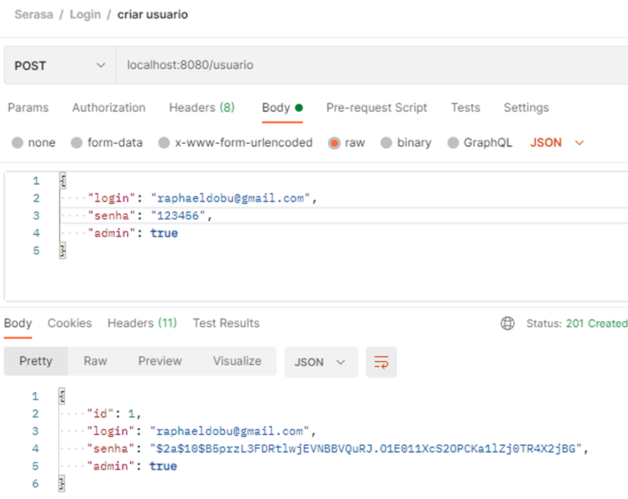
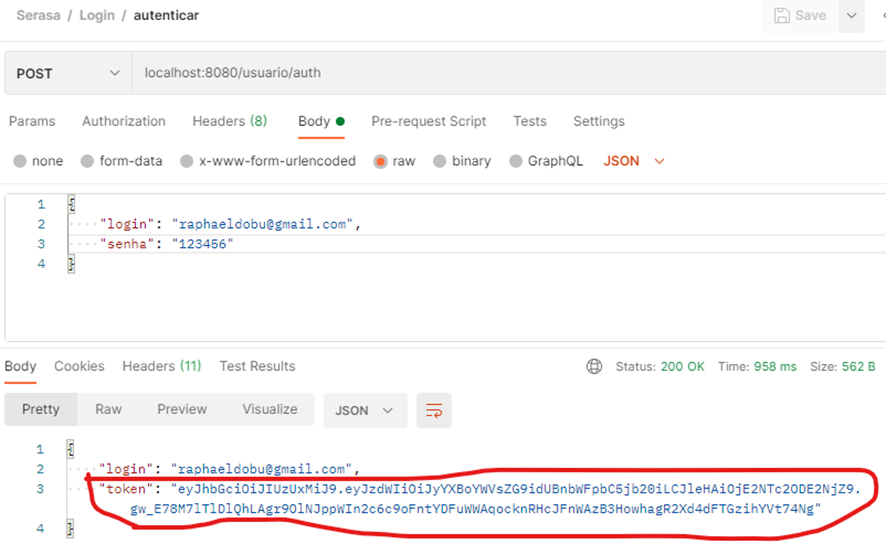
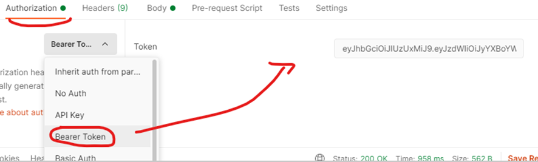
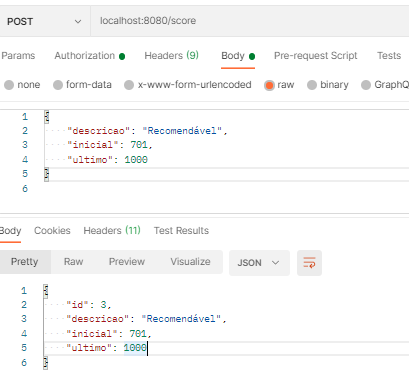
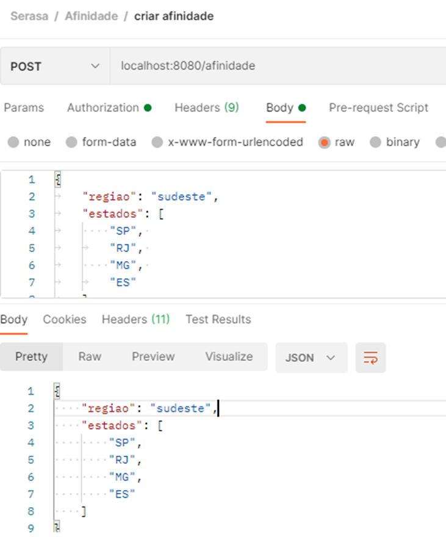
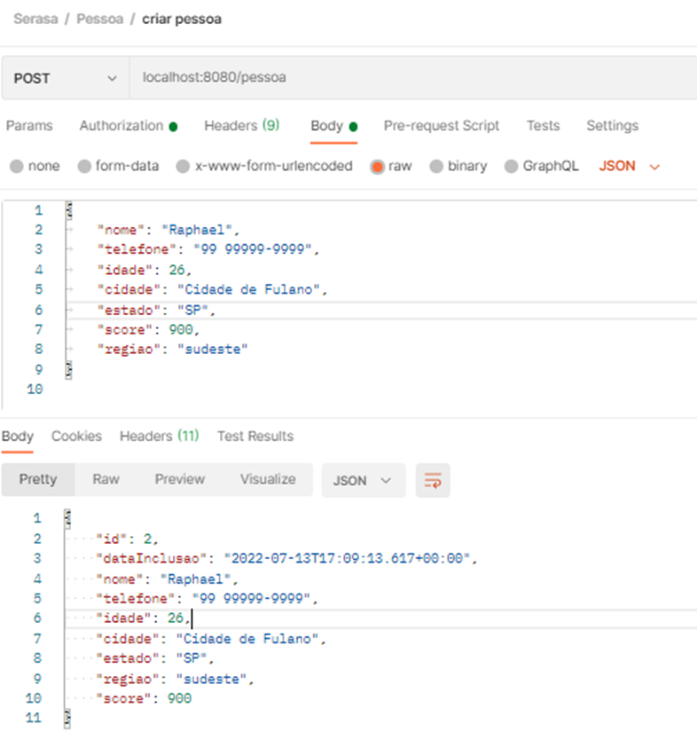
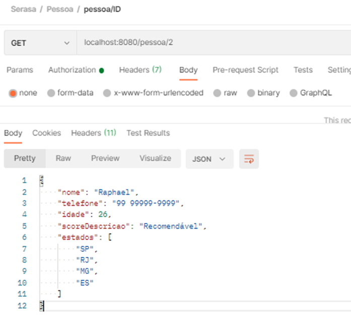
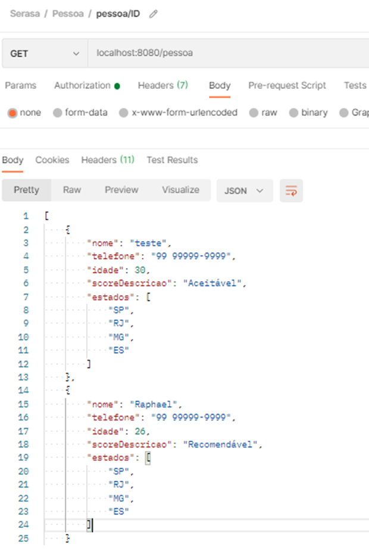

# projeto-serasa
Implementação do projeto para o Serasa utilizando Java11/Spring, H2 database, Swagger e SpringSecutiry + JWT.

## Etapas para testar a aplicação:
####1) Criar um usuário na rota localhost:8080/usuario e com seguinte formato JSON:
````
{
   "login": "raphaeldobu@gmail.com",
   "senha": "123456",
   "admin": true
}
````
Exemplo abaixo e retorno:


####2) Autenticar na rota localhost:8080/usuario/auth e com seguinte formato JSON:
````
{
    "login": "raphaeldobu@gmail.com",
    "senha": "123456"
}
````


###OBS: Para todos os exemplos abaixo deve pegar esse valor do token (em azul) e colocar na aba Authorization e escolher a opção Bearer Token e colocar o valor token no campo.
####Segue o exemplo:



###OBS: Como coloquei validação se existe Afinidade e Score salvos antes de criar uma Pessoa, então devemos salvar primeiro esses dois dados, caso não estejam salvos irão ocorrer exceções.

####3) Criar um Score na rota localhost:8080/score com seguinte formato de JSON:
````
{
"descricao": "Recomendável",
"inicial": 701,
"ultimo": 1000
}
````


####4) Criar Afinidade na rota localhost:8080/afinidade com seguinte formato JSON:
````
{
"regiao": "sudeste",
    "estados": [
        "SP",
        "RJ",
        "MG",
        "ES"
    ]
}
````



####5) Criar Pessoa na rota localhost:8080/pessoa e com seguinte formato de JSON:
````
{
    "nome": "Raphael",
    "telefone": "99 99999-9999",
    "idade": 26,
    "cidade": "Cidade de Fulano",
    "estado": "SP",
    "score": 900,
    "regiao": "sudeste"
}
````




####6) Buscar pessoa por ID na rota localhost:8080/pessoa/1:




####7) Buscar por todas as pessoas na rota localhost:8080/pessoa:


   

